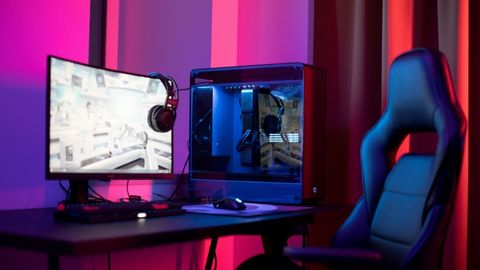

# aula do dia 18/06

### Resumo com apenas 1 imagem

Logo no inicio da aula eu me apresentei, falando meu nome, idade, moradia etc...
logo depois vimos que o computador era formado por 2 parte **HARDWARE e SOFTWARE**.

## Parte HARDWARE

Ha parte de HARDWARE nos vimos que é a parte fisica do computador, que é composta por:
- placa mãe 
- memoria
- procesador 
- mause
- monitor

E que a lingua falana no HARDWARE é ''**lingua binaria**''.

## parte SOFTWARE

Na parte Software nos vimos que é a parte logica do computador.
- aplicações 
- SO-OS 

o que é SO/OS? é o que gerencia meu hardware.

### algumas traduções e seus conceitos.

**Kernel**= nucleo do sistema operacional 
função:  uma interface de comunicação direta com meu hardware.

**Biblioteca de função padrão**= todo sistema que precisa de pequenos codigos de funções pequena.

[link de uma aula para ajudar](https://www.youtube.com/watch?v=zmj5RvlIucU&authuser=0)

..